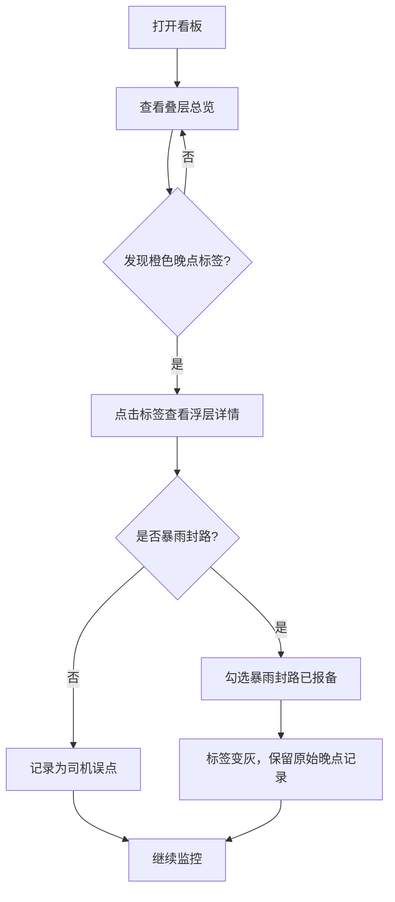

## 1. 产品概述

高考送考线路实时调度监控看板——为县教体局调度室提供 23 条送考线路的「计划时间带 × 实际 GPS」叠层可视化，实现晚点自动标注、多维度筛选与一键核实，消除对讲记录与 GPS 平台两套系统的信息差。

- 核心问题：对讲记录与 GPS 平台数据割裂，复盘时堵车与误点无法对齐
- 目标用户：县教体局调度室值班员、调度主任
- 目标价值：晚点 8 分钟以上自动标橙、点击查看速度与路况，5 分钟内定位问题线路

## 2. 核心功能

### 2.1 用户角色

| 角色 | 进入方式 | 核心权限 |
|------|----------|----------|
| 值班员 | 浏览器直接访问 | 查看线路、筛选、点击晚点标签查看详情 |
| 调度主任 | 浏览器直接访问 | 同值班员 + 勾选暴雨封路报备 |
| iPad 只读用户 | iPad 竖屏浏览器 | 仅查看，不允许写免责 |

### 2.2 功能模块

1. **主看板页**：叠层时间带图表、顶部筛选栏、晚点标签、右侧浮层详情

### 2.3 页面详情

| 页面名称 | 模块名称 | 功能描述 |
|----------|----------|----------|
| 主看板页 | 顶部筛选栏 | 多选考点、车辆编号、是否含特殊考生；勾选暴雨封路已报备 |
| 主看板页 | 叠层时间带图表 | 纵轴按考点分组，横轴 05:30–09:00，半透明色带=计划到达窗，实线折线=GPS 采样点 |
| 主看板页 | 晚点标签 | 色带与折线分离>8min 时该段变橙，左侧挂「晚点待核实」标签 |
| 主看板页 | 右侧浮层 | 点击晚点标签后展示最近三次采样速度与路况备注 |
| 主看板页 | 暴雨报备 | 勾选后标签变灰但不抹掉原始晚点记录 |

## 3. 核心流程

值班员打开浏览器 → 查看叠层时间带总览 → 发现橙色晚点标签 → 点击标签查看速度与路况 → 判断堵车/误点 → 勾选暴雨封路报备（如有）→ 标签变灰但保留记录

## 4. 用户界面设计

### 4.1 设计风格

- 主色调：深蓝 #1a2332 背景 + 荧光绿 #00e676 强调 + 橙色 #ff9100 预警
- 次色调：半透明色带使用线路对应色彩（按考点分色，alpha 0.25）
- 按钮：圆角 6px，扁平风格，hover 时微亮
- 字体：数据用等宽字体 JetBrains Mono，标题用 Noto Sans SC
- 布局：顶部筛选栏固定，主图表区域自适应，右侧浮层绝对定位覆盖

### 4.2 页面设计概览

| 页面名称 | 模块名称 | UI 元素 |
|----------|----------|---------|
| 主看板页 | 顶部筛选栏 | 多选下拉框×3、复选框×1，深色背景白字 |
| 主看板页 | 叠层时间带图表 | ECharts 自定义 canvas，纵轴考点分组标签，横轴时间刻度 |
| 主看板页 | 晚点标签 | 橙色圆角标签附着于色带左侧，灰色为已报备状态 |
| 主看板页 | 右侧浮层 | 半透明深色面板，显示速度折线 + 路况文字，点击外部关闭 |

### 4.3 响应式

- 桌面端（≥1024px）：完整筛选 + 图表 + 浮层
- iPad 竖屏（768px）：只读模式，筛选栏折叠为横向滚动，禁用暴雨报备勾选

### 4.4 3D 场景指导

不适用
