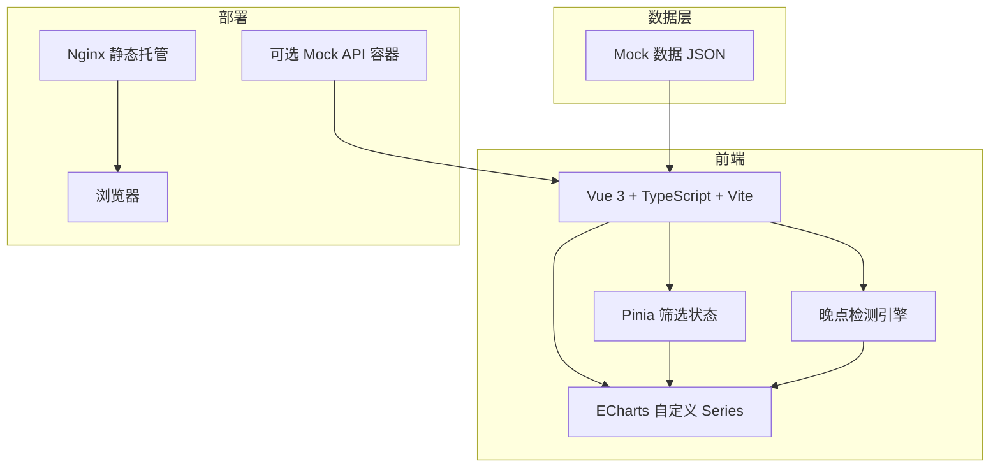
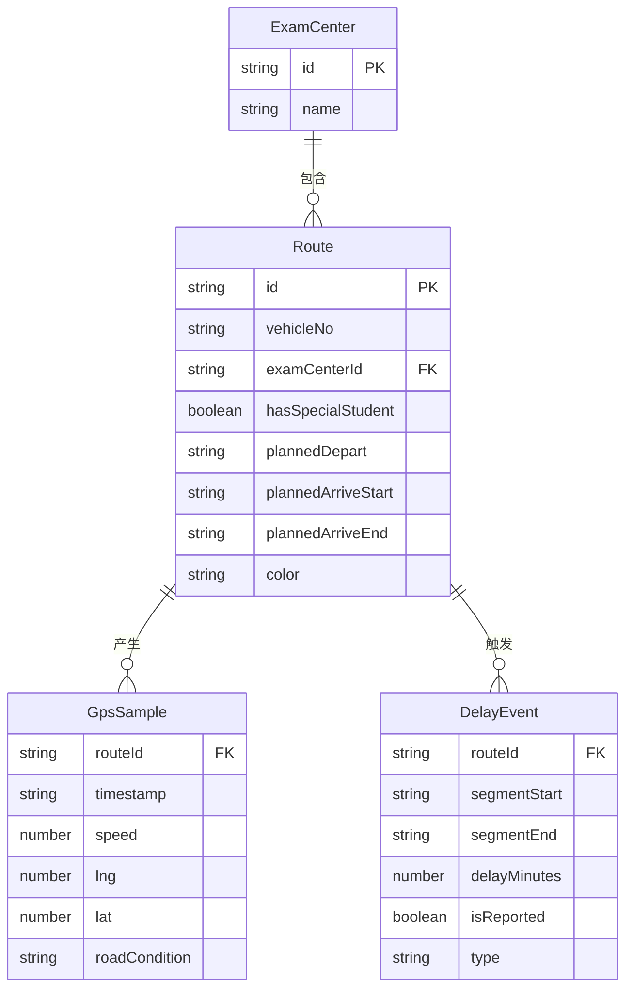

## 1. 架构设计



## 2. 技术说明

- 前端：Vue 3 + TypeScript + Vite + Tailwind CSS
- 初始化工具：vite-init（vue-ts 模板）
- 状态管理：Pinia（筛选态、晚点标签态、报备态）
- 图表：ECharts 5 自定义 series（renderItem 实现色带 + 折线叠层）
- 后端：无（纯前端 Mock 数据，可选 Mock API 容器）
- 数据库：无（全部 Mock JSON）

## 3. 路由定义

| 路由 | 用途 |
|------|------|
| / | 主看板页，叠层时间带 + 筛选 + 浮层 |

## 4. API 定义

无后端 API。Mock 数据直接在前端 JSON 文件中定义，包含：
- 线路列表（23 条）
- 考点列表
- 计划到达时间窗
- GPS 采样点（每 2 分钟一个采样）
- 晚点事件
- 路况备注

### 数据类型定义

```typescript
interface ExamCenter {
  id: string
  name: string
}

interface Route {
  id: string
  vehicleNo: string
  examCenterId: string
  hasSpecialStudent: boolean
  plannedDepart: string
  plannedArriveStart: string
  plannedArriveEnd: string
  color: string
}

interface GpsSample {
  routeId: string
  timestamp: string
  speed: number
  lng: number
  lat: number
  roadCondition: string
}

interface DelayEvent {
  routeId: string
  segmentStart: string
  segmentEnd: string
  delayMinutes: number
  isReported: boolean
  type: '堵车' | '司机误点' | '其他'
  recentSamples: GpsSample[]
}
```

## 5. 服务端架构图

不适用（纯前端项目）

## 6. 数据模型

### 6.1 数据模型定义



### 6.2 数据定义语言

全部使用 TypeScript 接口定义 + Mock JSON 生成，无需数据库 DDL。
